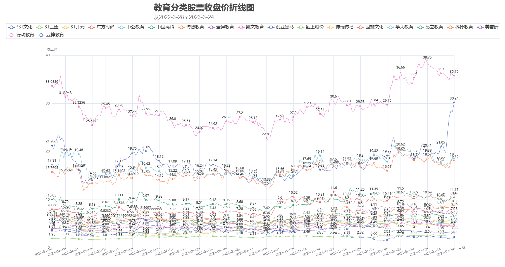

该项目将雪球网多支教育类股票的收盘价进行数据爬取，并可视化成折线图。

dataset 保存爬取到的数据（csv文件）

picture 保存pyecharts制作好的视图（html文件）

DataCrawling.py 使用requests库爬取股票数据，将股票数据按股票代码、股票名称、日期、开盘价、最高价、最低价、收盘价、涨跌额、涨跌幅度、成交量、成交额和换手率拆分，并通过pandas保存成csv文件

DataVisualization.py 通过pandas读取csv格式的数据，并使用pyecharts配置并制作视图

